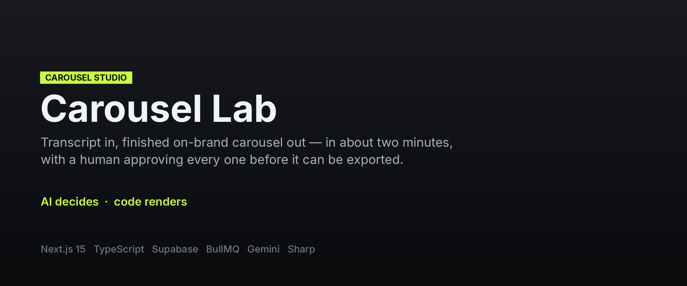
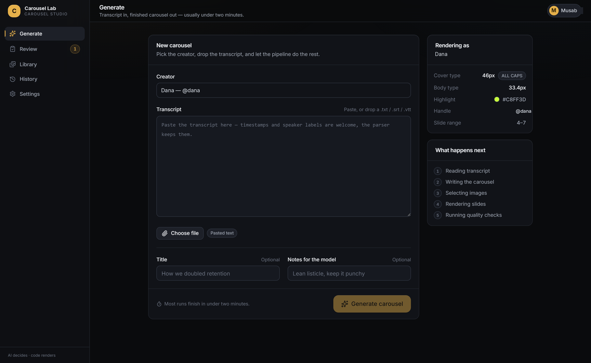
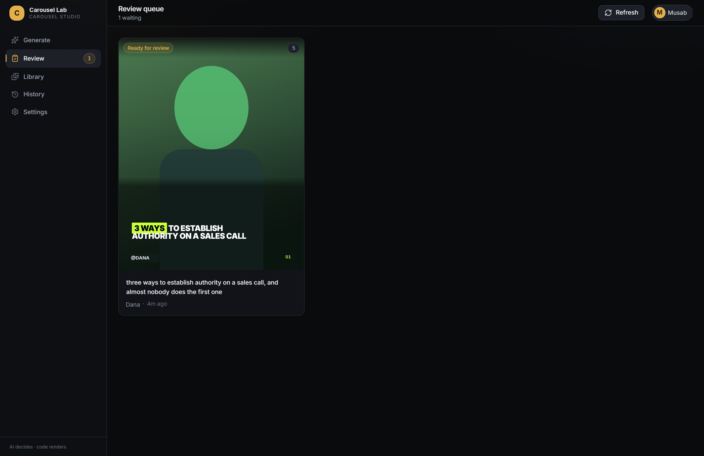
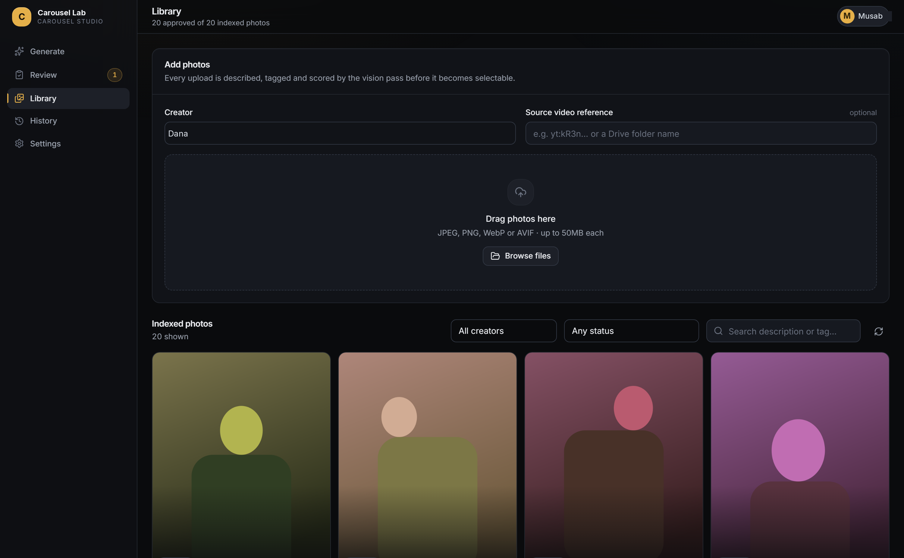
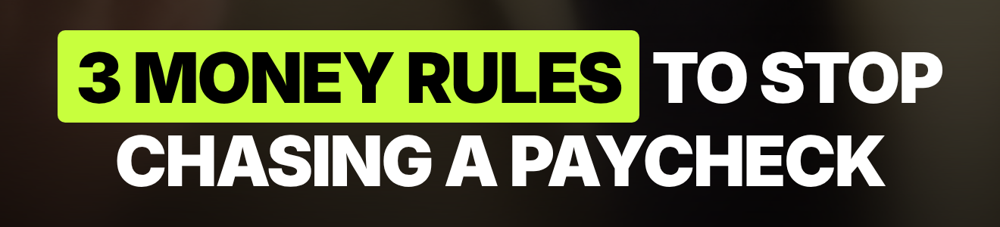
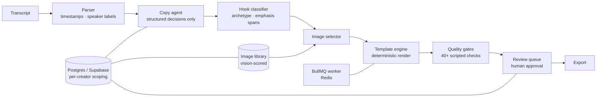

**[← All systems](https://github.com/musabqazi)** · [Hook Lab](https://github.com/musabqazi/hook-lab) · [Caption Lab](https://github.com/musabqazi/caption-lab) · [Portfolio](https://github.com/musabqazi/portfolio)

# Carousel Lab

**Transcript in, finished on-brand Instagram carousel out, in about two minutes — with a human approving every one before it can be exported.**

🟢 **In production** · **Client:** content agency (anonymised) · **Source:** private, available on request

## The problem

A content agency turns long-form video into carousels for a roster of creators. Doing it by hand takes a designer an hour per carousel and the output drifts — the cover type creeps a few pixels, the highlight colour is *nearly* right, one creator's voice bleeds into another's. Handing the whole job to a model makes drift worse, not better: ask an LLM to lay out a slide and you get a different layout every run.

## What I built

- **A split that makes drift impossible.** Models return structured *decisions* only — copy, hook classification, emphasis spans, image choice, layout variant. A deterministic template engine turns those decisions into pixels. The cover type is exactly 46px and the body exactly 33.4px because code sets them, not because a model was asked nicely.
- **A vision pass over the image library.** Every uploaded photo is described, tagged and scored before it becomes selectable, so slide image choice is a lookup over indexed evidence rather than a guess.
- **Per-creator scoping enforced in the database**, not the UI. A creator's rules, handle and library reach a run only when that creator is selected — a trigger on the auth table enforces the domain allowlist for OTP, magic link, password and direct API calls alike.
- **A human gate before export.** Nothing leaves the system unapproved. The review editor also works the other way round: write the copy by hand from the first line and let the engine render it.
- **Reproducible output.** Same input, same pixels. Over 40 scripted checks each prove one property against the real system rather than a mock.

## Screenshots

Generate — the creator's render contract is visible before anything runs: cover type, body type, highlight colour, handle, slide range.

<table>
  <tr>
    <td width="50%" valign="top"> Review queue — nothing exports unapproved.</td>
    <td width="50%" valign="top"> Library — each photo scored by the vision pass before it can be selected.</td>
  </tr>
</table>

The emphasis span, rendered by the template engine — the model chose <em>which</em> words, the code chose every pixel.

## Architecture

## Stack

## My role

Architecture, the template engine, the gate system, the BullMQ worker, the image library tooling and vision pass, the review editor, the per-creator scoping model, and the VPS deployment.

## Outcomes

- Carousel turnaround went from about an hour of designer time to roughly two minutes of machine time plus a human approval.
- Output is reproducible run to run — the property the deterministic renderer exists to guarantee, and the one the check suite proves.
- One creator's rules cannot reach another creator's run; scoping is enforced at the database, not in the interface.

## A note on what you can see here

Screenshots use seeded demo data and pseudonymised creator names. Real client content, transcripts and caption libraries are not published. The source is private — happy to walk through it.

---
Part of the <a href="https://github.com/musabqazi">musabqazi portfolio</a> — real systems, anonymised data, source private. © 2026 Musab Qazi
